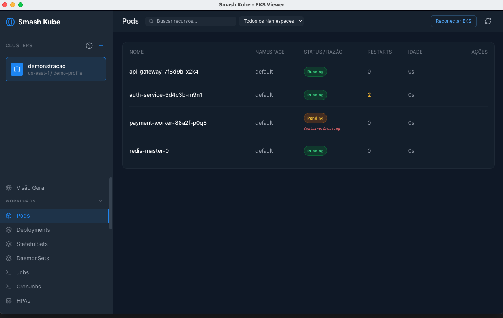
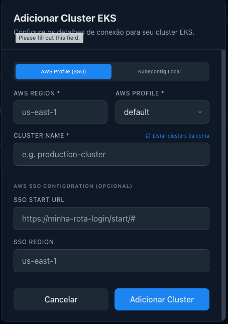
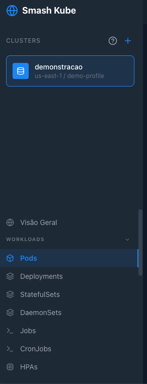
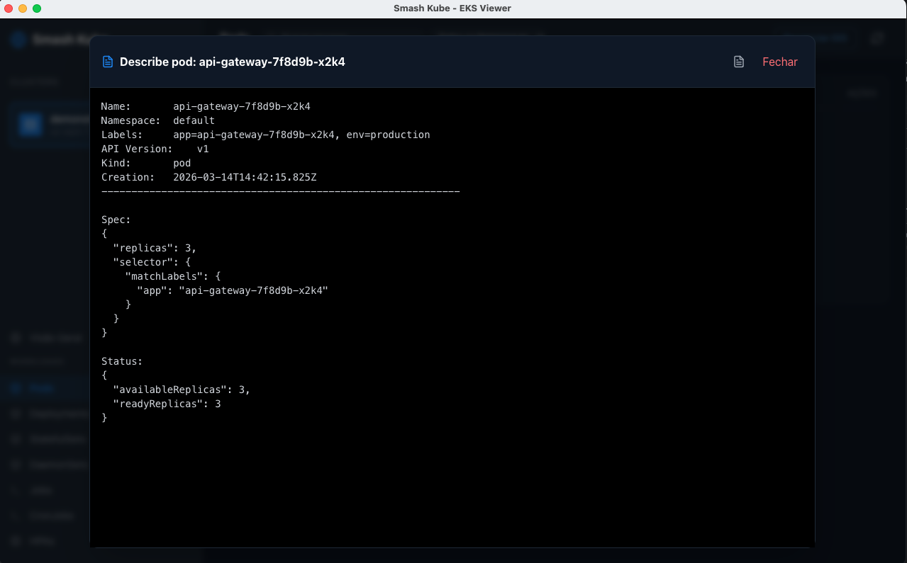

# Smash Kube 🚀

[](https://github.com/smash-kube/smash-kube/actions/workflows/ci.yml)
[](https://opensource.org/licenses/MIT)

Uma interface gráfica (GUI) moderna e intuitiva para visualização e consulta de clusters Kubernetes, com foco especial em ambientes **Amazon EKS**. O projeto foi desenvolvido para facilitar a vida de desenvolvedores e engenheiros de plataforma que precisam de uma visão rápida e detalhada de seus recursos sem a necessidade de comandos complexos no terminal.

Este é um projeto **Open Source**. Contribuições são muito bem-vindas! Veja o arquivo [CONTRIBUTING.md](CONTRIBUTING.md) para saber como ajudar.




## 🎯 Funcionalidades Principais

- **Gestão de Clusters Local**: Adicione e gerencie múltiplos clusters EKS em uma única interface. As configurações são armazenadas localmente com segurança.
- **Autenticação Flexível**:
  - Suporte total a **AWS SSO (IAM Identity Center)** via seleção automática de perfis do AWS CLI.
  - Suporte a **Kubeconfig Local** (padrão ou caminho customizado).
- **Visualização de Recursos**:
  - **Workloads**: Pods, Deployments, StatefulSets, DaemonSets, Jobs, CronJobs e HPAs.
  - **Rede**: Services, Ingresses e Endpoints.
  - **Configuração**: ConfigMaps, Secrets e ResourceQuotas.
  - **Armazenamento**: PersistentVolumes (PV), PersistentVolumeClaims (PVC) e StorageClasses.
  - **Cluster**: Visão geral de Nodes e Eventos do cluster.
- **Inspeção Técnica Avançada**:
  - **Describe Nativo**: Visualização técnica detalhada de qualquer recurso, simulando o comando `kubectl describe` sem a necessidade do binário instalado no sistema.
  - **Inspeção JSON**: Acesso direto à representação original do objeto no Kubernetes.
  - **Logs em Tempo Real**: Visualização de logs de Pods com suporte a logs da execução anterior (pre-restart).
- **Modo Somente Consulta**: A aplicação foi desenhada para ser segura, permitindo apenas a visualização de recursos, eliminando o risco de exclusões acidentais em produção.

## 📸 Guia de Uso Visual

### 1. Adicionando um Cluster
Abra o modal de adição de cluster clicando no botão **"+"** na barra lateral. O Smash Kube oferece duas formas principais de conexão:

#### A. AWS Profile (SSO)
Recomendado para EKS e perfis configurados via AWS CLI.
- **AWS Profile**: Seleção automática de perfis existentes no seu `~/.aws/config`.
- **AWS Region**: A região onde o cluster EKS está localizado.
- **Listar clusters**: Botão para buscar automaticamente os clusters disponíveis na conta e região selecionadas.
- **SSO Start URL (Opcional)**: Caso precise especificar uma URL de login diferente da configurada no perfil.

#### B. Kubeconfig Local
Permite usar contextos já configurados na sua máquina (EKS, Minikube, Kind, etc).
- **Caminho do Kubeconfig (Opcional)**: Se deixado em branco, utiliza o padrão `~/.kube/config`. Caso contrário, informe o caminho completo para o arquivo.

> **Dica:** Para obter o arquivo de configuração de um cluster EKS via terminal, você pode executar:
> ```bash
> aws eks update-kubeconfig --name <NOME_CLUSTER> --region <REGIAO> --profile <PROFILE>
> ```



### 2. Navegando pelos Recursos
Utilize a barra lateral para alternar entre as diferentes categorias de recursos do Kubernetes.



### 3. Describe e Logs
Clique nos ícones de ação para ver detalhes técnicos ou logs em tempo real.



## 🛠️ Tecnologias Utilizadas

- **Electron**: Framework para aplicação desktop cross-platform.
- **React**: Interface de usuário reativa e moderna.
- **Tailwind CSS**: Estilização rápida com foco em design escuro (Dark Mode).
- **@kubernetes/client-node**: Cliente oficial para comunicação direta com a API do Kubernetes.
- **Lucide React**: Biblioteca de ícones elegantes.

## ✅ Pré-requisitos

Para utilizar o Smash Kube, você precisará de:

1.  **AWS CLI** instalado e configurado em sua máquina.
2.  Permissões de leitura no cluster EKS alvo.
3.  **Node.js** (apenas se desejar compilar o projeto a partir do código fonte).

> **Nota importante:** Diferente de outras ferramentas, o Smash Kube **NÃO exige** o `kubectl` instalado para funcionar, pois utiliza a API nativa do Kubernetes.

## 🚀 Como Executar (Desenvolvimento)

Se você estiver clonando este repositório para desenvolvimento:

```bash
# Instalar dependências
npm install

# Iniciar em modo de desenvolvimento (Webpack + Electron)
npm start

# Iniciar em MODO DEMO (Dados fictícios para prints e testes)
npm run start:demo
```

## 🖼️ Modo de Demonstração (DEMO)

O Smash Kube possui um modo especial para demonstrações, treinamentos ou capturas de tela sem a necessidade de uma conexão real com a AWS ou Kubernetes.

Ao executar `npm run start:demo`:
1. Uma conexão chamada **"demonstracao"** aparecerá automaticamente na barra lateral.
2. Ao selecionar essa conexão, a aplicação carregará dados fictícios (Pods, Deployments, Nodes, Logs, etc.) instantaneamente.
3. Nenhuma chamada real será feita à API da AWS ou do Kubernetes, tornando-o seguro para uso em qualquer ambiente.

## 📦 Build e Distribuição

Para gerar o executável (dmg, exe ou appimage) para o seu sistema:

```bash
npm run build
```
Os arquivos gerados estarão na pasta `dist/`.

## 🔐 Segurança e Privacidade

- **Credenciais**: A aplicação utiliza os perfis de autenticação já configurados na sua máquina via AWS CLI. Nenhuma credencial AWS é armazenada de forma insegura ou enviada para servidores externos.
- **Login Automático**: Se sua sessão AWS expirar, o Smash Kube tentará abrir automaticamente o navegador para o login do SSO.

---
Desenvolvido com o objetivo de simplificar a observabilidade de clusters Kubernetes.
