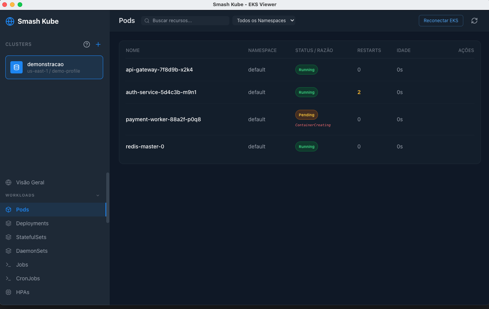
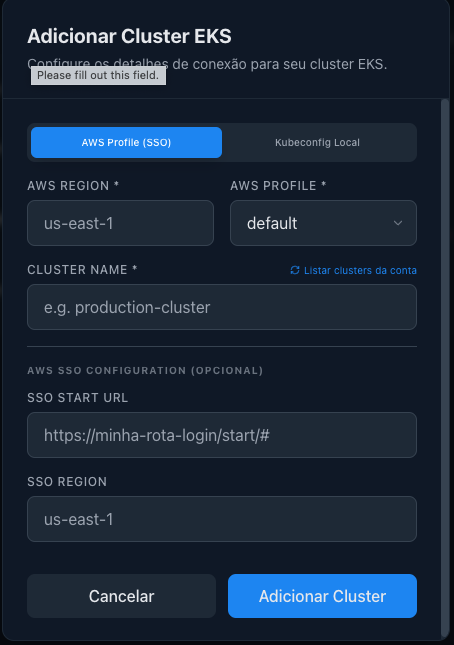
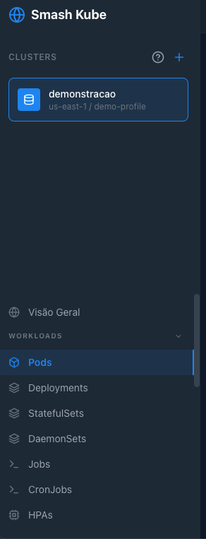
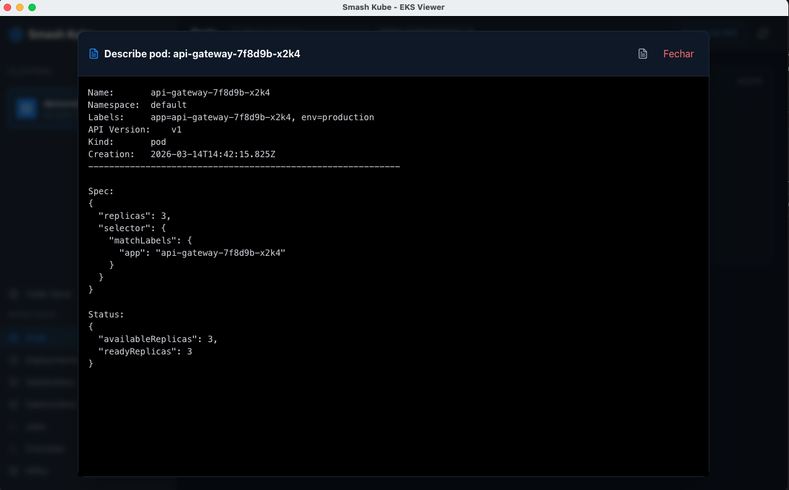

# Smash Kube

> A read-only desktop GUI for Kubernetes clusters — built for Amazon EKS, and it does not need `kubectl`.

[](https://github.com/asengardeon/smash-kube/actions/workflows/ci.yml)
[](https://github.com/asengardeon/smash-kube/releases)
[](https://opensource.org/licenses/MIT)

🇧🇷 [Leia em português](README.pt-BR.md)

Smash Kube gives developers and platform engineers a fast, detailed view of their
Kubernetes resources without composing terminal commands. It talks to the
Kubernetes API directly, so **`kubectl` does not need to be installed**, and it is
**read-only by design** — there is no code path that can delete a resource in
production.



## Download

Grab a build from the [latest release](https://github.com/asengardeon/smash-kube/releases/latest):

| Platform | File |
|---|---|
| Windows | `smash-kube-portable.exe` |
| Linux | `smash-kube.AppImage` |
| macOS | `smash-kube.dmg` |

No installation step — the Windows build is portable and the Linux build is an
AppImage.

## Features

**Cluster management** — add and manage multiple EKS clusters in one window.
Configuration is stored locally.

**Flexible authentication**
- **AWS SSO (IAM Identity Center)** with automatic AWS CLI profile discovery
- **Local kubeconfig**, default path or a custom one

**Resource browsing**
- **Workloads** — Pods, Deployments, StatefulSets, DaemonSets, Jobs, CronJobs, HPAs
- **Network** — Services, Ingresses, Endpoints
- **Configuration** — ConfigMaps, Secrets, ResourceQuotas
- **Storage** — PersistentVolumes, PersistentVolumeClaims, StorageClasses
- **Cluster** — Nodes and cluster Events

**Technical inspection**
- **Native describe** — the detail view of `kubectl describe`, without the binary
- **Raw JSON** — the original Kubernetes object representation
- **Live logs** — Pod logs, including the previous container run (pre-restart)

**Read-only mode** — the application only reads. Accidental deletion in production
is not possible.

## Usage

### Adding a cluster

Click **"+"** in the sidebar. Two connection modes are available:

**A. AWS Profile (SSO)** — recommended for EKS and profiles configured through the
AWS CLI.
- **AWS Profile** — picked automatically from your `~/.aws/config`
- **AWS Region** — where the EKS cluster lives
- **List clusters** — discovers available clusters in the selected account and region
- **SSO Start URL** (optional) — if you need a login URL other than the profile's

**B. Local kubeconfig** — uses contexts already on your machine (EKS, Minikube, Kind).
- **Kubeconfig path** (optional) — defaults to `~/.kube/config`

> To generate a kubeconfig entry for an EKS cluster:
> ```bash
> aws eks update-kubeconfig --name <CLUSTER_NAME> --region <REGION> --profile <PROFILE>
> ```



### Browsing resources

Use the sidebar to move between Kubernetes resource categories.



### Describe and logs

Click the action icons on any resource for technical detail or live logs.



## Requirements

1. **AWS CLI** installed and configured
2. Read permissions on the target EKS cluster
3. **Node.js** — only if you build from source

`kubectl` is **not** required.

## Built with

- **Electron** — cross-platform desktop shell
- **React** — user interface
- **Tailwind CSS** — styling, dark-mode first
- **@kubernetes/client-node** — official client, talks to the Kubernetes API directly
- **Lucide React** — icons

## Development

```bash
# install dependencies
npm install

# run in development (Webpack + Electron)
npm start

# run in DEMO mode (fixture data, no AWS or Kubernetes connection)
npm run start:demo
```

### Demo mode

`npm run start:demo` adds a connection named **demonstracao** to the sidebar,
backed by fixture data — Pods, Deployments, Nodes, logs. No call is made to AWS or
Kubernetes, which makes it safe for demos, training and screenshots in any
environment.

## Build

```bash
npm run build
```

Artifacts are written to `dist/` (`.exe`, `.AppImage` or `.dmg`, depending on your
platform).

## Security and privacy

- **Credentials** — the app uses the authentication profiles already configured on
  your machine through the AWS CLI. No AWS credential is stored insecurely or sent
  to any external server.
- **Session expiry** — if your AWS session expires, Smash Kube opens the browser
  for SSO login automatically.

## Contributing

Contributions are welcome — see [CONTRIBUTING.md](CONTRIBUTING.md).

## License

MIT — see [LICENSE](LICENSE).